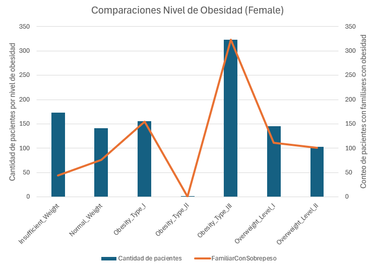
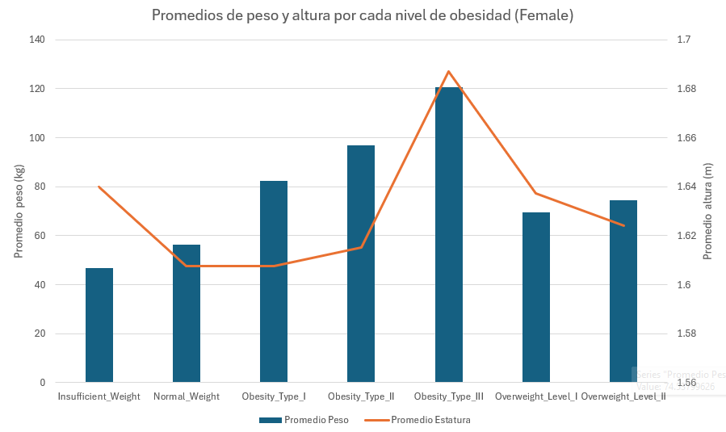
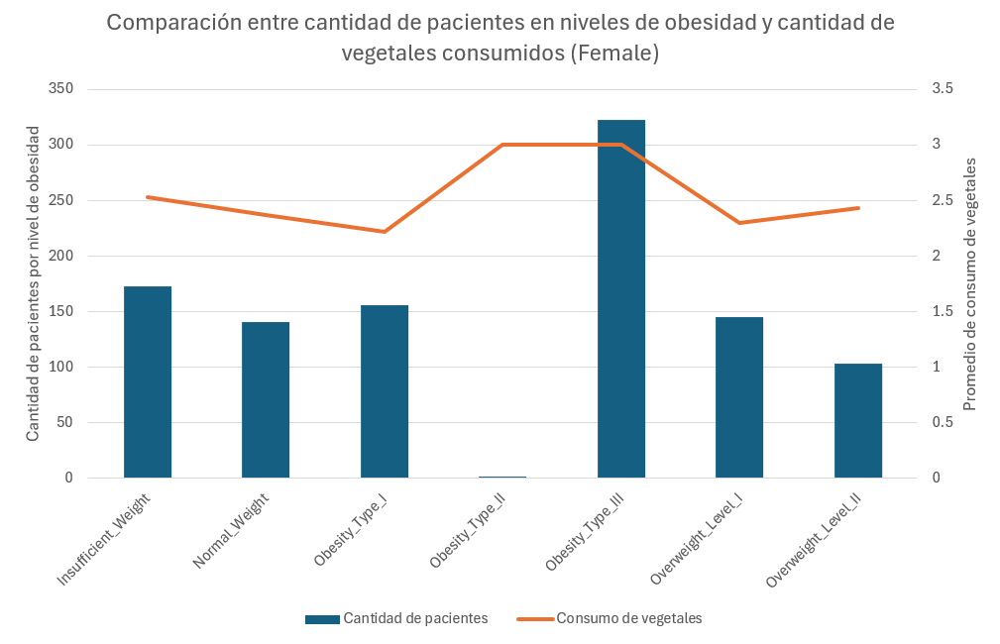
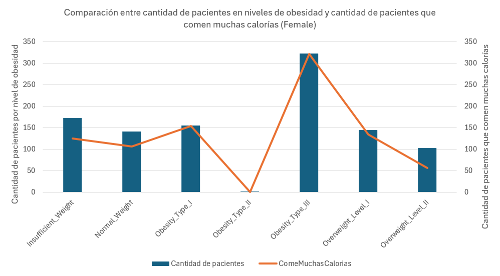

# Universidad de Monterrey  
## Inteligencia Artificial 1  
**Profesor:** Antonio Martínez Torteya  
**Unidad 1:** Regresión  
**Actividad:** A1.1 Aprendizaje estadístico-automático  

**Nombre:** David Díaz Paz y Puente  
**Matrícula:** 650794  
**Fecha:** 19 de enero de 2026  

---

## 1. Introducción

En la presente actividad se lleva a cabo un análisis exploratorio de una base de datos diseñada para un estudio realizado por la Universidad de la Costa, en Colombia, cuyo propósito es identificar y analizar los factores asociados a distintos niveles de obesidad en pacientes provenientes de Colombia, Perú y México. La base de datos integra información correspondiente a variables demográficas, hábitos de vida y condiciones de salud, así como una variable categórica que clasifica el nivel de obesidad de cada individuo.

El objetivo principal de este análisis es obtener una síntesis representativa del conjunto de datos que permita comprender su estructura general, distribución y posibles relaciones entre variables. Asimismo, se plantea de manera hipotética la incorporación de una variable adicional que pudiera enriquecer el análisis y aportar mayor valor explicativo a la investigación, junto con la definición de una posible variable de salida derivada de un estudio de inferencia sobre los datos existentes.

Finalmente, se desarrolla un análisis gráfico enfocado en una subpoblación del estudio, con el fin de visualizar y analizar la relación entre las variables que conforman la base de datos y la variable de salida propuesta, facilitando así la interpretación de patrones y tendencias relevantes.

---

## 2. Metodología

### a. Exploración inicial de los datos

La base de datos analizada está conformada por un total de **2 111 registros** correspondientes a pacientes, cuyas variables se encuentran asociadas al estudio y determinación de distintos niveles de obesidad. La población se divide en dos subpoblaciones de acuerdo con el género —masculino y femenino—, ambas caracterizadas por la presencia de variables de naturaleza cualitativa y cuantitativa.

Las variables que conforman la base de datos se clasifican de la siguiente manera:

**Variables cualitativas**
- Sexo  
- Edad  
- Familiar con sobrepeso (sí/no)  
- Consume muchas calorías (sí/no)  
- Fumador (sí/no)  
- Nivel de obesidad  

**Variables cuantitativas**
- Estatura  
- Peso  
- Consumo de vegetales  
- Consumo de agua  

De manera general, se observa que la base de datos presenta ciertas limitaciones en la especificación de algunas variables, particularmente aquellas relacionadas con hábitos de consumo. Por ejemplo, no se establece con claridad el periodo temporal al que corresponde el consumo de vegetales o de agua, lo cual puede afectar la interpretación de los datos. Asimismo, existen variables cuya definición puede inducir a ambigüedad o sesgo, como el criterio utilizado para clasificar el consumo de “muchas” calorías, al no contar con un umbral cuantitativo claramente definido.

Un estudio realizado en la Universidad Nacional de Colombia identificó, a partir de un conjunto inicial de 16 variables independientes, aquellas con mayor relevancia en la determinación del grado de sobrepeso: género, peso, altura, índice de masa corporal, edad e historial familiar de sobrepeso (Castrillón, 2021).

---

### b. Propuesta de variable adicional

Siguiendo la estructura general de la base de datos, se propone la incorporación de una variable independiente adicional dentro del eje de hábitos de vida. En particular, se propone la variable **minutos de actividad física por semana**, definida como el tiempo total acumulado de actividad física de intensidad moderada o vigorosa realizada por el individuo durante un periodo de siete días.

De acuerdo con la Organización Mundial de la Salud (OMS, 2021), los niños y adolescentes entre 5 y 17 años deberían realizar al menos 60 minutos diarios de actividad física, mientras que los adultos entre 18 y 64 años deberían acumular entre 150 y 300 minutos semanales. Esta variable permitiría clasificar a los individuos en niveles de actividad física insuficiente, adecuada o elevada, facilitando la identificación de patrones de sedentarismo.

La inclusión de esta variable permitiría analizar de manera más precisa la relación entre el nivel de actividad física y el nivel de obesidad, fortaleciendo el poder explicativo del análisis y reduciendo la ambigüedad presente en otras variables relacionadas con hábitos de vida.

---

### c. Definición de una variable de interés para inferencia

La variable más adecuada para fungir como variable de salida o respuesta es el **nivel de obesidad**, ya que constituye el objetivo central de la investigación y permite sintetizar el estado nutricional de cada paciente de manera integral. Esta variable categórica facilita el análisis conjunto de la influencia de hábitos de vida, antecedentes familiares y condiciones de salud sobre el grado de obesidad.

Variables como el peso corporal o el índice de masa corporal resultan menos idóneas, ya que el peso no distingue la composición corporal y el IMC suele ser una variable derivada que no siempre se encuentra explícitamente definida. El estudio original clasifica directamente a los individuos según su nivel de obesidad, lo que refuerza la pertinencia de esta variable como respuesta para un análisis inferencial.

---

## 3. Resultados

### a. Análisis gráfico enfocado en una subpoblación

Para el análisis gráfico se seleccionó como subpoblación al **género femenino**, con el objetivo de reducir la variabilidad asociada al sexo y facilitar una interpretación más focalizada de los resultados.

**** Comparación entre la cantidad total de pacientes femeninas en cada nivel de obesidad y aquellas con antecedentes familiares de sobrepeso.  
Se observa que, conforme aumenta el nivel de obesidad, también se incrementa el número de individuos con historial familiar de sobrepeso, particularmente en obesidad tipo I y tipo III, lo que sugiere una posible asociación genética y ambiental.

**** Promedios de peso corporal y estatura por nivel de obesidad.  
Se identifica un incremento progresivo del peso promedio a medida que aumentan los niveles de obesidad, mientras que la estatura se mantiene relativamente constante, indicando que el peso es el principal factor diferenciador.

**** Comparación entre cantidad de pacientes y consumo promedio de vegetales.  
No se observa una relación estrictamente inversa entre consumo de vegetales y nivel de obesidad, lo que sugiere que este hábito no actúa de manera aislada y probablemente interactúa con otros factores.

**** Comparación entre cantidad de pacientes y consumo elevado de calorías.  
La mayor concentración de pacientes se presenta en obesidad tipo III, coincidiendo con el mayor número de individuos que reportan consumir muchas calorías, lo que sugiere una posible asociación entre hábitos alimenticios hipercalóricos y mayores niveles de obesidad.

---

## 4. Conclusión

El análisis exploratorio permitió identificar patrones relevantes entre el nivel de obesidad y variables asociadas a hábitos de vida y antecedentes de salud. El análisis gráfico enfocado en la subpoblación femenina evidenció la naturaleza multifactorial de la obesidad, destacando el papel del peso corporal, los antecedentes familiares y el consumo elevado de calorías.

Si bien los resultados no implican causalidad, proporcionan evidencia descriptiva suficiente para justificar la aplicación de métodos inferenciales y modelos de aprendizaje estadístico en estudios posteriores, así como la incorporación de variables adicionales que fortalezcan el análisis.

---

## 5. Anexos

[Base de datos](raw.csv)

[Base de datos (modificada/final)](main.xlsx)

---

## 6. Referencias

Castrillón, O. D. (2021). *Las variables más influyentes en la obesidad: un análisis desde la minería de datos*. Información Tecnológica, 32(6), 123–132. https://doi.org/10.4067/s0718-07642021000600123  

Organización Mundial de la Salud. (2021). *Directrices de la OMS sobre actividad física y comportamientos sedentarios*. https://iris.who.int/items/65310979-92e8-4c98-8092-5a16ca07fc2f
